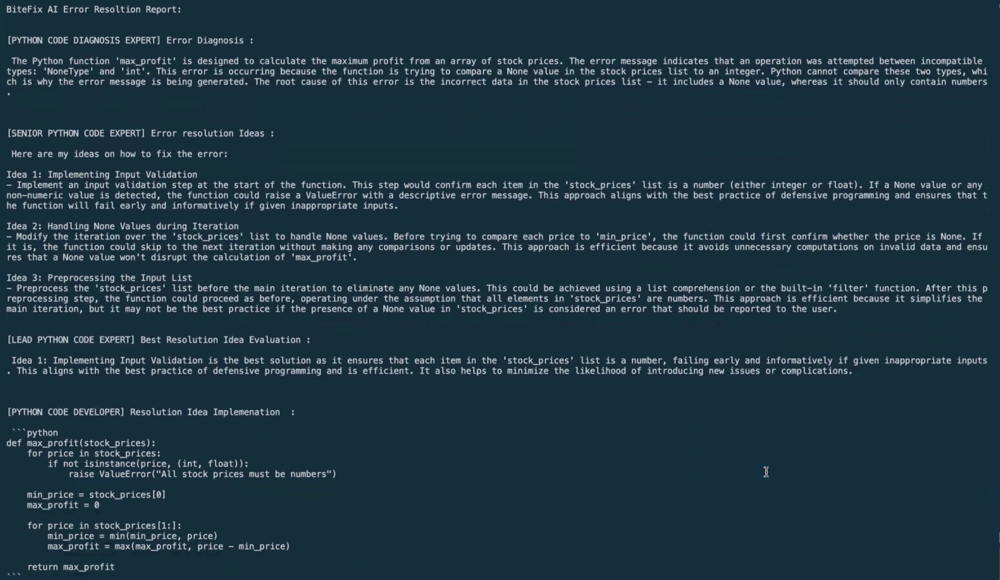

# BiteFix 🛠️


[](https://github.com/Pallavi-Sinha-12/Expense-Tracker-Chatbot/stargazers)
[](https://github.com/Pallavi-Sinha-12/bitefix/forks)


BiteFix is an advanced and efficient Python library designed to revolutionize the error-fixing process which leverages multi agents framework concept to provide a seamless debugging experience. It offers decorators to help you debug your code when the function throws runtime errors.

## Table of Contents 📋

- [Introduction](#Introduction)
- [Technologies Used](#Technologies-Used)
- [Getting Started](#Getting-Started)
- [Examples](#Examples)
- [Contributing](#Contributing)
- [Feedback](#Feedback)
- [Conclusion](#Conclusion)
- [Contact](#Contact)
- [License](#License)
- [References](#References)

## Introduction

By offering decorators, BiteFix empowers you to enhance the error-handling experience in your functions. When a decorated function encounters an error, the decorator orchestrates a team of AI Agents, each specializing in a unique aspect of error resolution. Here's a brief overview of the AI Agents:

🕵️ **Python code Diagnosis Expert**: Swiftly analyzes the code to pinpoint the root cause of the error.

👨‍💻 **Senior Python Developer**: Provides insightful ideas on how to rectify the issue within the decorated function's code.

👩‍💼 **Lead Python Developer**: Meticulously evaluates ideas, selecting the most effective one for implementation.

👨‍💻 **Python Code Developer**: Skillfully rewrites the code to bring the chosen idea to life, ultimately fixing the error.

BiteFix simplifies the error-fixing journey by seamlessly combining the expertise of these AI Agents, ensuring a smoother and more efficient debugging process for your Python code.


## Technologies-Used

- [](https://www.python.org/)
- [](https://api.python.langchain.com/en/latest/langchain_api_reference.html#)
- [](https://github.com/joaomdmoura/crewAI.git)
- [](https://openai.com/)

## Getting-Started

- Install BiteFix using `pip install bitefix`
- Explore the powerful decorators to streamline your error-fixing process!
- Check out the [examples](#examples) to understand how BiteFix works.

Happy Coding! 🚀

## Examples

Let's take a look at some examples to understand how BiteFix works. Bitefix offers two decorators: `@resolve` and `@resolve_with_openai`.

### Example 1 : Using Open AI Models

Let's say you have a function that calculates the maximum profit that can be obtained from a given array of stock prices.
We will use `@resolve_with_openai` decorator with our function to help us resolve the error if some runtime error occurs while executing the function.

```python

from bitefix import resolve_with_openai

function_description = """
This function calculates the maximum profit that can be obtained from a given array of stock prices, aiding in financial analysis.
Stock prices represent daily closing prices of a stock over time, obtained from financial data sources.
"""

@resolve_with_openai(openai_api_key="YOUR_OPENAI_KEY", model_name="gpt-4", function_description= function_description, export_dir="logs", verbose=True)
def max_profit(stock_prices):

    min_price = stock_prices[0]
    max_profit = 0 

    for price in stock_prices[1:]:
        min_price = min(min_price, price)
        max_profit = max(max_profit, price - min_price)

    return max_profit

```

`openai_api_key` : The OpenAI API key to use the OpenAI's model. You can get the API key from [here](https://beta.openai.com/account/api-keys).
`model_name` (optional) : The name of the model to be used. By default, it uses OpenAI's gpt-4 model.
`function_description` (optional) : The description of the function to be used to understand the context of the function. By default, it is set to None.
`temperature` (optional) : The temperature parameter for the model. By default, it is set to 0.7.
`export_dir` (optional) : The directory path to export Error Resoltion Report by BiteFix AI Agents and fixed code python file. It will export the report if a directory is provided. By default, it is set to None.
`verbose` (optional) : If set to True, it will print the debugging steps. By default, it is set to True.

Now, let's call the function and see how it works.

```python

stock_prices = [7, 1, 5, 3, 6, 4, None]
max_profit = max_profit(stock_prices)
print("Maximum profit from stock market analysis:", max_profit)

```

Below is the Error Resolution Report generated by the decorator.


Here is the full demo for the above example - [bitefix_decorator_example](https://drive.google.com/file/d/1_5lOo9HZIhYyenV-Y0WG_TuCVIgTg9hT/view?usp=sharing)


We can see how this decorator provided us step by step debugging of the function in case of failure by using crew of Python AI coders. It also provided us with the solution to the error.

### Example 2 : Using Open Source Models

If we want to use some other Large Language Model instead of OpenAI, we can use `@resolve` decorator with our function to help us resolve the error if the function fails while execution. This helps us to use any custom trained model as well for error resolution.

For this example, let's use Openhermes model from Ollama. You can download Ollama from [here](https://ollama.ai/). Ollama allows you to run open-source large language models, such as Openhermes, Llama 2, locally. 

After downloading Ollama, install it. Then run the following command to pull the Openhermes model.

```bash
ollama pull openhermes
```

Now, we can use the model with the decorator `@resolve` as follows.

```python

from bitefix import resolve
from langchain_community.llms.ollama import Ollama

llm = Ollama(model = "openhermes")

function_description = """
This function calculates the maximum profit that can be obtained from a given array of stock prices, aiding in financial analysis.
Stock prices represent daily closing prices of a stock over time, obtained from financial data sources.
"""

@resolve(llm = llm, function_description= function_description, export_dir="logs", verbose=True)
def max_profit(stock_prices):

    min_price = stock_prices[0]
    max_profit = 0 

    for price in stock_prices[1:]:
        min_price = min(min_price, price)
        max_profit = max(max_profit, price - min_price)

    return max_profit

stock_prices = [7, 1, 5, 3, 6, 4, None]
max_profit = max_profit(stock_prices)
print("Maximum profit from stock market analysis:", max_profit)


```

Note : Here `function_description`, `export_dir` and `verbose` are optional parameters.

Similarly, we can use any other Large Language Model with the decorator.

## Contributing

Contributions are always welcome!

If you find any issue or have suggestions for improvements, please submit them as Github issues or pull requests.

Here is the steps you can follow to contribute to this project:

1. Fork the project on Github.
2. Clone the forked project to your local machine.
3. Create a virtual environment using `python -m venv venv`.
4. Activate the virtual environment using `venv\Scripts\activate` on Windows or `source venv/bin/activate` on Mac/Linux
5. Install the dependencies using `pip install -r requirements.txt`.
6. Make the required changes.
7. Format the code using `black .`.
8. Create a pull request.


## Feedback

'bitefix' library is just a small step towards making the error-fixing process more efficient using the capabilities of Large Language Models. We have to go a long way to make this better.
Feel free to send me feedback at dataaienthusiast128@gmail.com. Let me know if you have any suggestions on how to make this project better.

If you liked the project support it by giving a star :star: to this repo.

## Conclusion

- BiteFix is a powerful Python library that leverages the capabilities of Large Language Models to streamline the error-fixing process in Python. By offering decorators that orchestrate a team of AI Agents, BiteFix helps you resolve the runtime errors in your code efficiently. 
- ONE IMPORTANT OBSERVATION IS THAT CURRENTLY BITEFIX SHOWS GOOD RESULTS WITH INDEPENDENT FUNCTIONS. FOR FUNCTIONS WHICH CAN HAVE NESTED FUNCTIONS OR CLASSES, THE RESULTS MAY VARY. IN THOSE CASES, WE CAN CHOOSE TO GIVE THE FUNCTION DESCRIPTION TO THE DECORATOR TO GET BETTER RESULTS.

## Contact
[](https://www.linkedin.com/in/pallavi-sinha-09540917b/)[](https://github.com/Pallavi-Sinha-12)

## License

This project is licensed under the terms of the [MIT license](https://choosealicense.com/licenses/mit/)

## References

- crewAI: Cutting-edge framework for orchestrating role-playing, autonomous AI agents. https://github.com/joaomdmoura/crewAI

- langchain: Python library for interacting with the Langchain API. https://api.python.langchain.com/en/latest/langchain_api_reference.html#

- OpenAI: OpenAI is an artificial intelligence research laboratory consisting of the for-profit corporation OpenAI LP and its parent company, the non-profit OpenAI Inc. https://openai.com/

- Ollama: Ollama allows you to run open-source large language models, such as Openhermes, Llama 2, locally. https://ollama.ai/